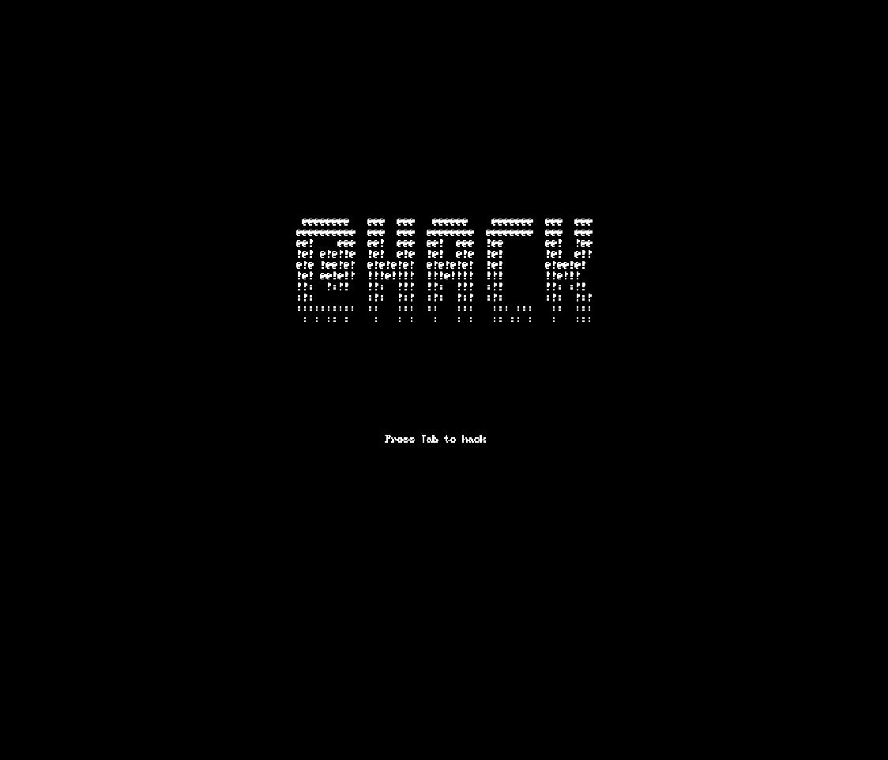
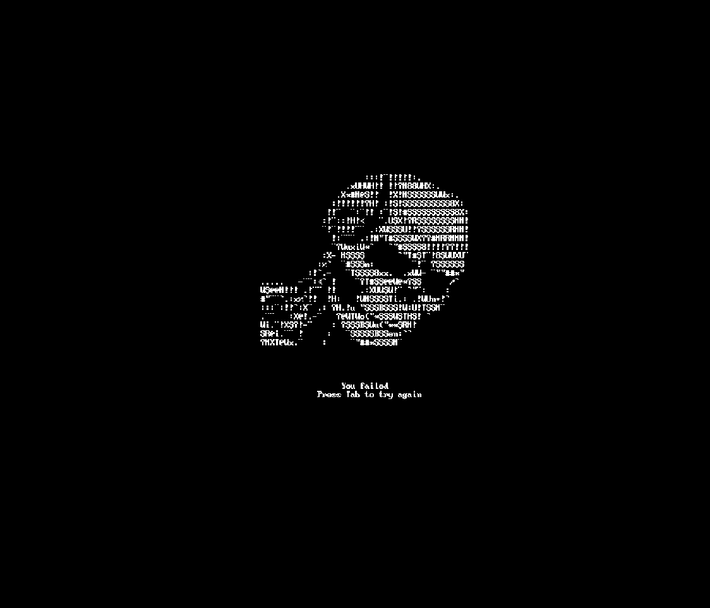
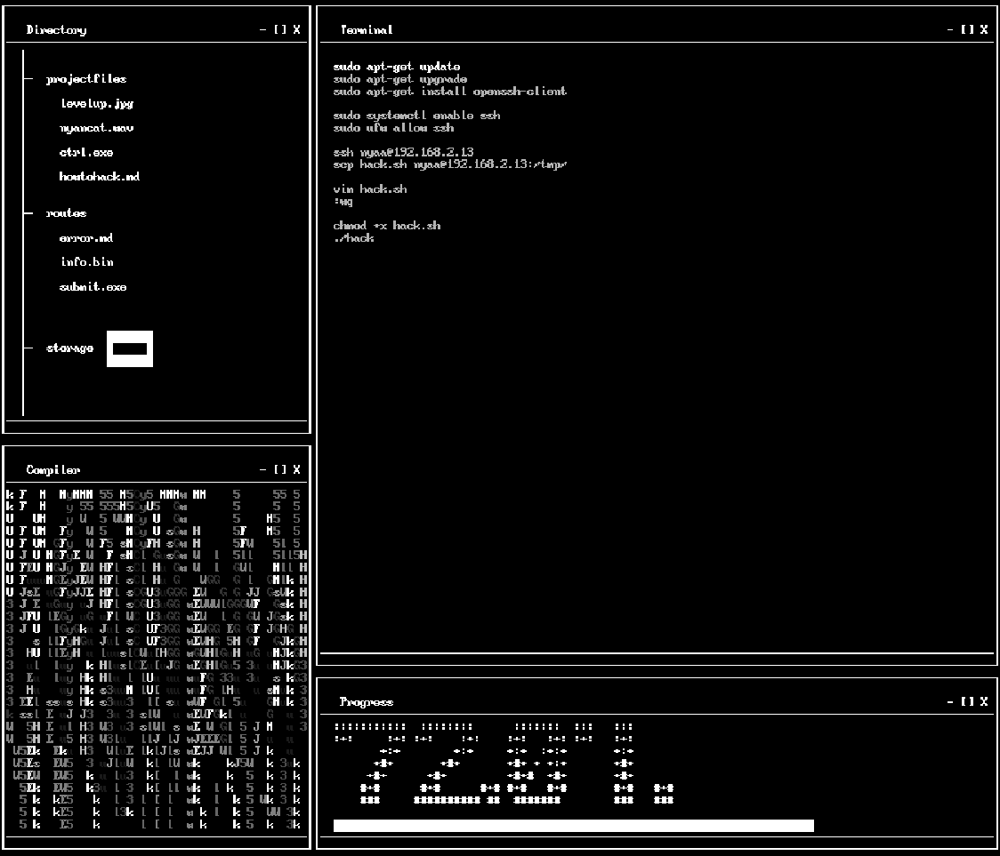
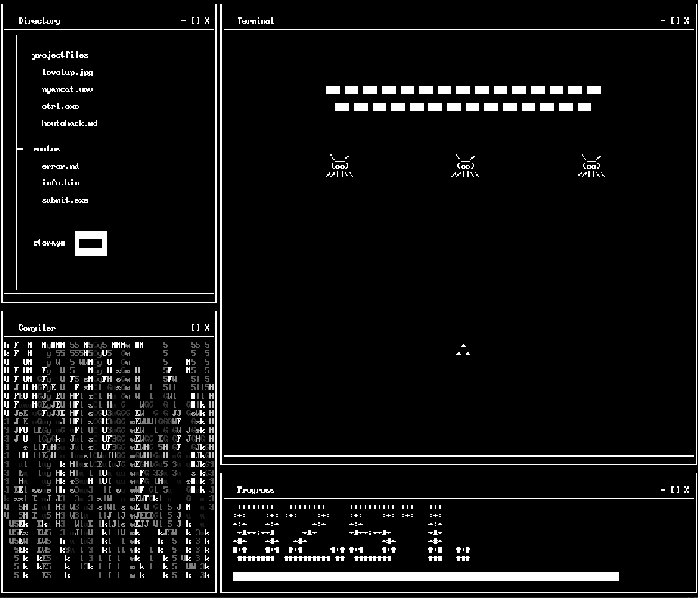

# @hack (æt hæk) 🔓

  
   

  
   

This game was developed for the second edition of the [Level Up! Game Jam](https://levelup2022.nei-isep.org/) event
organized by [NEI-ISEP](https://www.nei-isep.org/.

It was developed during a 48-hour period, using the [Cosplay](https://github.com/nivanov/cosplay) engine.

**Theme:** An Unconventional Weapon

## Awards 🏆

- Honorary mention

## Controls 🎮

### Typing

- **Keyboard** - Type what's in the terminal

### Shooter

- **Arrows** - Move the ship
- **Space** - Shoot

## Team 👥

- **Bárbara Pinto** ([@MadDinosaur](https://github.com/MadDinosaur)) - Art 🎨
- **Eduardo Correia** ([@Educorreia932](https://github.com/Educorreia932)) - Code 💻
- **Eduardo Silva** ([@eduardocsilva](https://github.com/eduardocsilva)) - Code 💻

